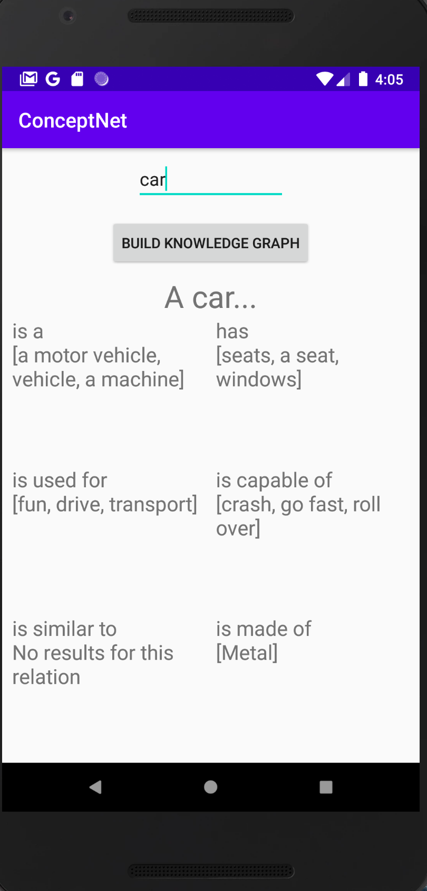

This is an android program that builds a knowledge graph for word/phrase.

It queries ConceptNet to find all the endpoints of different relations for the target word and stores it in a knowledge map for the target word.

This project plays with concurrency in android and is a good example of how to make syncronous volley http requests inside AsyncTasks that run in parallel with each other

